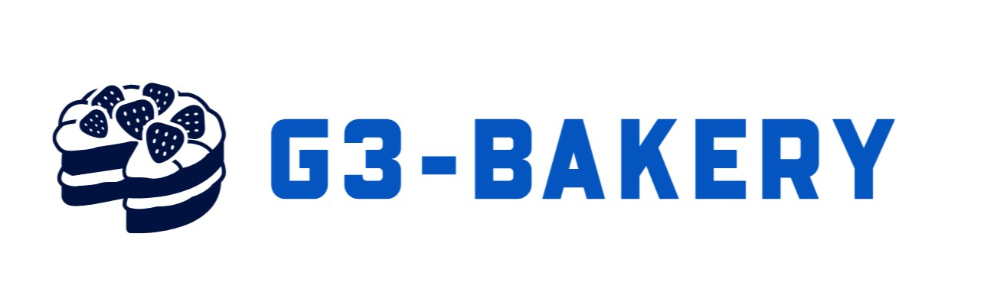

# web75_FullstackProject
## Production
- URL: [https://web75-g3bakery.onrender.com](https://web75-g3bakery.onrender.com)
- Backend URL: [https://backendtestdn.onrender.com/](https://backendtestdn.onrender.com)

## Documentations

##Technology
- Front-end: ReactJS + HTML + CSS, Redux-toolkit
- Back-end: MongDB, NodeJs, Express, 

## Member 

### Duy Bao Ngo (Leader)
- Roles: Leader, Front-end, Back-end.
- Front-end Tasks: Home page, landing page, admin page, set up project, product list page,  route-link, reporter.
- Back-end Tasks: Signup, Login, Logout, (CRUD, Token, Refresh Token, Cookies).

### Nhan Phu Le
- Roles: Front-end, Back-end
- Front-end Tasks: Product page, category list page, Cart page
- Back-end Tasks: Product, ProductInCart, Payment, Paypal, Cart (CRUD).

### Nhan Hao
- Roles: Front-end, Back-end
- Front-end Tasks: product list page.
- Back-end Tasks: Search, Filter, Sort, Pagination.

## Software Design
### Product
~~~
{
name:string,
price:number,
imgUrl:string,
description:string,
category:string,
newProduct: boolean
}
~~~
- Example:
~~~
{
name:'Corn cake',
price: 150.50,
imgUrl: 🔗,
description: "",
category: "cake",
newProduct: true
}
~~~
- Reality:
~~~
 "_id": "ObjectID",
 "name": "Bánh Quy Kẹp Phô Mai Trứng Muối",
 "price": 65000,
 "imgURL1": "https://www.sugartown.vn/thumb/500x500/2/upload/sanpham/ck-16715406953.png",
 "imgURL2": "https://www.sugartown.vn/thumb/500x500/2/upload/sanpham/ck-16715406953.png",
 "description": "Bột mì, Muối, Đường, Bơ lạt, Marshmallow, Trứng muối, Phô mai",
 "category": "BÁNH COOKIES",
 "newProduct": true,
 "bestSeller": false,
 "quantity": 20,
 "quantityInCart": 1
 
